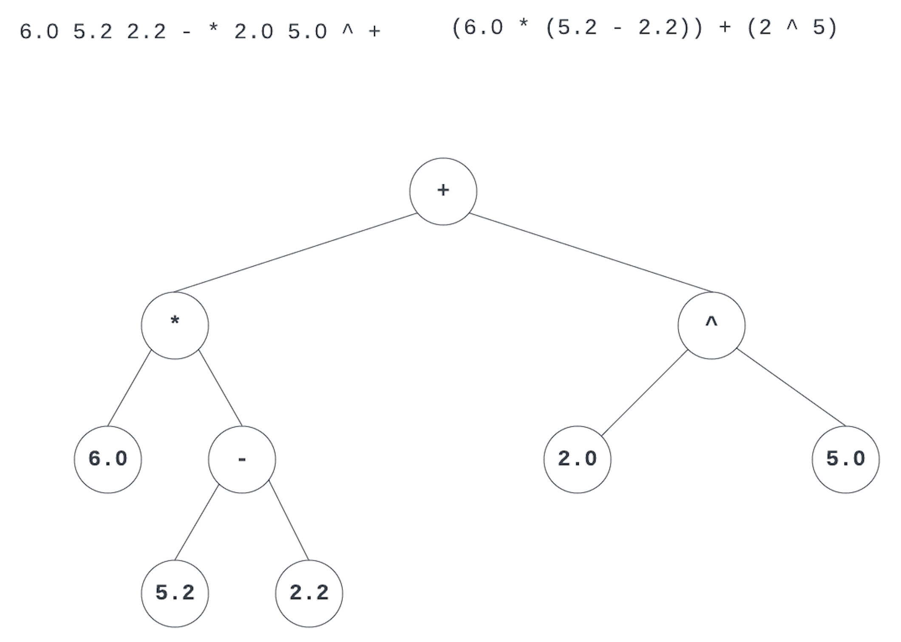

## Your Task for this Lab

In this lab you will need to design the classes and their code to:
* Read/Receive a postfix expression and from it create the Expression Tree. This is done by instantiating the class `Tree` and calling its method `BuildTree`. This operation creates in memory the tree. The root of the tree is pointed by data member `_root`. This data member is type `TreeNode*` which is left to you to implement.
    > HINT: A Tree Node has three parts: data, left and right. You will need to think about what is going to be the type of data. Remember that you will be storing numbers (operands), operators, evaluation values, etc.
* Once the tree is built in memory then you will need to traverse the three using all three traversal types (Inorder, Preorder, and Postorder). These traversals return a string showing the data on each of the tree nodes. For this you will call the `Tree::Traverse` method.
* The next phase is to evaluate the expression stored in the tree. This is done calling the `Tree::Evaluate`. This method returns a double that is the result of evaluating the expression.
* Lastly, you will implement the method `Tree::StepByStepCalculation` this method will send to the `ostream` parameter the data stored on each of the nodes as they were calculated. The information that this operation displays will show the "structure" of the tree.

### Step by Step Tasks

Given the following expression: `6 5.2 2.2 - * 2 5 ^ +` each of the steps explained above would look as follows.

#### Build Tree
The expression tree would graphically look like:


Another view of the tree, in text mode would be:
```
Operator +
    Operator *
        Operand 6.00
        Operator -
            Operand 5.20
            Operand 2.20
    Operator ^
        Operand 2.00
        Operand 5.00
```

#### Traversing the Tree
When traversing the tree generated in the previous step the result would be:
* **Inorder**: `6 * 5.2 - 2.2 + 2 ^ 5`
* **Preorder**: `+ * 6 - 5.2 2.2 ^ 2 5`
* **Postorder**: `6 5.2 2.2 - * 2 5 ^ +`

Note that on all the traversals operators and operands are separated by a single space. Also, the Postorder traversal should match the postfix expression used to create the tree.

#### Evaluating the Tree
When calling the `Tree::Evaluate` method, it will return `50.00` for this expression.

#### Outputting the Step by Step Evaluation
The expected output for this expression is:
```
{"value":50.00, "operator":"+", "operand":false, "id":0, "parent":-1}
{"value":18.00, "operator":"*", "operand":false, "id":1, "parent":0}
{"value":6.00, "operator":"#", "operand":true, "id":2, "parent":1}
{"value":3.00, "operator":"-", "operand":false, "id":3, "parent":1}
{"value":5.20, "operator":"#", "operand":true, "id":4, "parent":3}
{"value":2.20, "operator":"#", "operand":true, "id":5, "parent":3}
{"value":32.00, "operator":"^", "operand":false, "id":6, "parent":0}
{"value":2.00, "operator":"#", "operand":true, "id":7, "parent":6}
{"value":5.00, "operator":"#", "operand":true, "id":8, "parent":6}
```

Notice that each of the nodes of the tree is represented using JSON notation. Each node will have the following associated fields:
* `value` represents the evaluated value of the node. In the case of operand nodes the value is simply the value of the operand. In the case of an operator the value is the result of evaluating its children. For example the last three lines of the output above show:
    * operator ^
    * operand 2
    * operand 5
  
  So, the value of the node with operator ^ is 32 since $2^5=32$. This way the calculated values are propagated from bottom to top.
* `operator` stores the operator of the node. In the case that the node is an actual number this field will store `#`.
* `operand` is a boolean value that represents whether the node is storing an operand or not.
* `id` is an integer that identifies the node. It starts with 0 for the root of the tree, then 1 and 2 for the root's children, and so on. These ids are going to be used for the next field.
* `parent` is the id of the parent. Note in the list above, root's parent id is -1 since it doesn't have a parent. The nodes (operator: * id: 1) and (operand: 6 id: 2) would both have their `parent` field value set to 0, as the node with `id=0` is their parent.

## What you are Given

You are given the following files:
* `main.cpp` this file contains the source code for the tests for the `Tree` class. You **may not** modify this class in any way.
* `tree.h` and `tree.cpp` these files are the main interface of your assignment, you **must** implement the methods declared for the class `Tree` in `tree.cpp`. You may write more methods. But, if you don't implement the given methods your `main` will no longer work. See below for a description of the methods.
* `tree_node.h` and `tree_node.cpp` these files are mostly empty and are given to allow the program to compile. (it doesn't build though)

## Description of class `Tree`
The declaration of the class is:

```c++
enum TraversalType {INORDER, PREORDER, POSTORDER};


class Tree {
private:
    TreeNode* _root;
    Tree(const Tree& other);
    const Tree& operator=(const Tree& rhs);
public:
    Tree();
    ~Tree();
    bool BuildTree(const string& postfixExpression);
    string Traverse(TraversalType traversalType)const;
    double Evaluate()const;
    void StepByStepEvaluation(ostream& output, bool useLevel = false)const;
};

```

* The `enum TraversalType` in the beginning creates a new type that is used in the method `Traverse` to specify what kind of traversal the user of this class wants to do. For more information about enum read [here](https://cplusplus.com/doc/tutorial/other_data_types/), [here](https://en.cppreference.com/w/cpp/language/enum) or [here](https://www.geeksforgeeks.org/enumeration-in-cpp/).
* The class needs only one data member `_root`. This represents a pointer to the root of the tree.
* The methods of the class are:
  * `Tree(const Tree& other)` Copy constructor of the class. You _do not have_ to implement this method. I would be good exercise, but it is not expected.
  * `const Tree& operator=(const Tree& rhs)` Copy assignment operator of the class. You _do not have_ to implement this method. I would be good exercise, but it is not expected.
  * `Tree()` Default constructor, it only sets the `_root` to `nullptr`.
  * `~Tree()` Destructor. Takes care of deallocating all the memory used by the tree.
  * `bool BuildTree(const string& postfixExpression)` This is one of the most important methods of this assignment. The method takes in a string representing a postfix arithmetic expression. Given this expression the method will build the expression tree. If the method is unable to do it, then it should return false, if it was to successfully create the tree then it should return true. A hint for this method: _use a stack_.
  * `string Traverse(TraversalType traversalType)const` this method returns a string with the elements of the tree separated by spaces. The elements will be added to this string according to the type of traversal "requested" by the parameter. If you see lines 202, 203 and 204 in `main.cpp` you will note that this method is called three times, each time selecting one of the traversal types. 
  * `double Evaluate()const` this method evaluates the expression tree. It will return the number resulting from the evaluation.
  * `void StepByStepEvaluation(ostream& output, bool useLevel = false)const` this method will show expression tree with its evaluation values. Each evaluation step is represented by a JSON formatted line. The `output` parameter is where these strings are going to be sent to. The `useLevel` parameter is used when a _leveled` output is desired.

### Output for `StepByStepEvaluation`

* Expression = `4 3 + 2 5 * 1 / -`
* `useLevel = false`
```
{"value":-3.00, "operator":"-", "operand":false, "id":0, "parent":-1}
{"value":7.00, "operator":"+", "operand":false, "id":1, "parent":0}
{"value":4.00, "operator":"#", "operand":true, "id":2, "parent":1}
{"value":3.00, "operator":"#", "operand":true, "id":3, "parent":1}
{"value":10.00, "operator":"/", "operand":false, "id":4, "parent":0}
{"value":10.00, "operator":"*", "operand":false, "id":5, "parent":4}
{"value":2.00, "operator":"#", "operand":true, "id":6, "parent":5}
{"value":5.00, "operator":"#", "operand":true, "id":7, "parent":5}
{"value":1.00, "operator":"#", "operand":true, "id":8, "parent":4}
